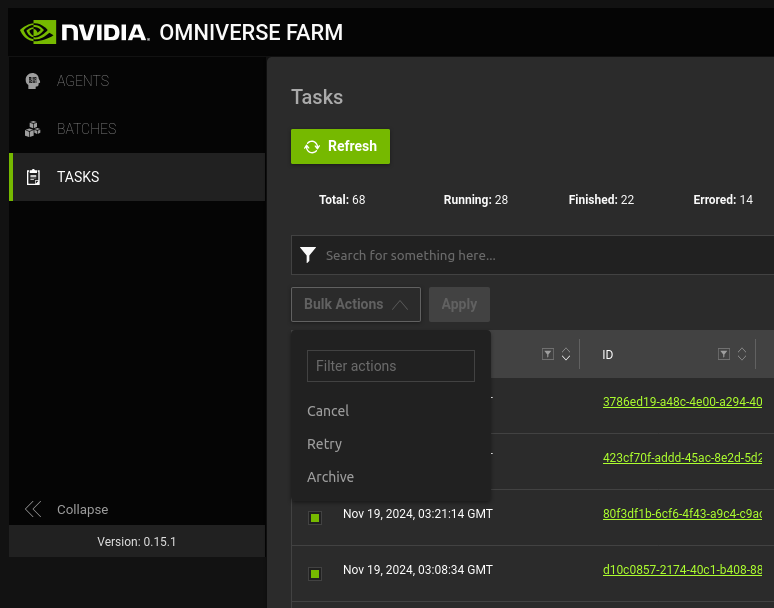

# Running Isaac Sim Workloads on Omniverse Farm

These scripts are only tested on Linux environment (Ubuntu). If you are using MacOS or Windows, consider using Virtual Box to setup a Ubuntu virtual machine. WSL2 may work but hasn't been tested. Please note that these scripts only support x86 architecture, and will not work on ARM architecture.

## Support Matrix

The scripts below are currently based on Isaac Sim 4.5.0 and Isaac Lab 2.0.0. The scripts should work on other versions of Isaac Sim and Isaac Lab, but you may need to modify the scripts accordingly.

### Isaac Sim

| Docker Image | Isaac Sim | Ubuntu |
|--------------|-----------|--------|
| [`j3soon/omni-farm-isaac-sim:4.5.0`](https://hub.docker.com/r/j3soon/omni-farm-isaac-sim/tags?name=4.5.0) | 4.5.0 | 22.04.5 LTS |
| [`j3soon/omni-farm-isaac-sim:4.2.0`](https://hub.docker.com/r/j3soon/omni-farm-isaac-sim/tags?name=4.2.0) | 4.2.0 | 22.04.3 LTS |
| [`j3soon/omni-farm-isaac-sim:4.1.0`](https://hub.docker.com/r/j3soon/omni-farm-isaac-sim/tags?name=4.1.0) | 4.1.0 | 22.04.3 LTS |
| [`j3soon/omni-farm-isaac-sim:4.0.0`](https://hub.docker.com/r/j3soon/omni-farm-isaac-sim/tags?name=4.0.0) | 4.0.0 | 22.04.3 LTS |
| [`j3soon/omni-farm-isaac-sim:2023.1.1`](https://hub.docker.com/r/j3soon/omni-farm-isaac-sim/tags?name=2023.1.1) | 2023.1.1 | 22.04.3 LTS |

### Isaac Lab

| Docker Image | Isaac Lab | Isaac Sim | Ubuntu |
|--------------|-----------|-----------|--------|
| [`j3soon/omni-farm-isaac-lab:2.0.0`](https://hub.docker.com/r/j3soon/omni-farm-isaac-lab/tags?name=2.0.0) | 2.0.0 | 4.5.0 | 22.04.5 LTS |
| [`j3soon/omni-farm-isaac-lab:1.4.1`](https://hub.docker.com/r/j3soon/omni-farm-isaac-lab/tags?name=1.4.1) | 1.4.1 | 4.2.0 | 22.04.3 LTS |

## Installing Omniverse Farm

> Only the cluster admin should read this section. Please skip to the [Setup section](#setup) if you are a user or already have Omniverse Farm installed.

### (Optional) Pre-Installation

Before proceeding with the installation, make sure you have modified the following values:

- `max_capacity: 32`  
  The default maximum capacity of the Omniverse Farm [is set to 32](https://docs.omniverse.nvidia.com/farm/latest/deployments/kubernetes.html#b-capacity-tuning). You can modify this value to a number larger than the GPUs available in your system. This can be found in the `values.yaml` file in the `omniverse-farm-x.x.x.tgz` file:
  ```yaml
  capacity:
    # -- Specify the max number of jobs the controller is allowed to run.
    max_capacity: 32
  ```
  and modify it to something like:
  ```yaml
  capacity:
    # -- Specify the max number of jobs the controller is allowed to run.
    max_capacity: 1024
  ```

> Note that the pre-installation steps are not tested on a real machine yet. Please refer to the post-installation steps for the tested steps.

### Installation

Follow the official [installation guide](https://docs.omniverse.nvidia.com/farm/latest/deployments/introduction.html) to install Omniverse Farm.

After installation, you should have a installed [Farm Queue](https://docs.omniverse.nvidia.com/farm/latest/queue.html), and one or more [Farm Agent](https://docs.omniverse.nvidia.com/farm/latest/agent.html) workers installed, which can be connected to the queue in subsequent steps. All Farm Agents should have access to the USD scenes that would be used in the submitted jobs through Nucleus.

Follow [this example](https://docs.omniverse.nvidia.com/farm/latest/farm_examples.html) to test your Omniverse Farm installation. First, [submit a rendering job](https://docs.omniverse.nvidia.com/farm/latest/farm_examples.html#send-a-render-to-the-queue) through [Movie Capture](https://docs.omniverse.nvidia.com/extensions/latest/ext_core/ext_movie-capture.html). Next, [connect a Farm Agent to the Farm Queue](https://docs.omniverse.nvidia.com/farm/latest/farm_examples.html#add-agents-to-execute-on-the-render-task), and make sure the job finished successfully by checking the output files. Please skip the [Blender decimation example](https://docs.omniverse.nvidia.com/farm/latest/farm_examples.html#custom-decimation-task) in the documentation, as it is not relevant to this repository.

> This repo is tested on Omniverse Farm 105.1.0 with [Kubernetes set up](https://docs.omniverse.nvidia.com/farm/latest/deployments/kubernetes.html). The scripts are tested within a environment consists of multiple OVX server nodes with L40 GPUs, a CPU-only head node, along with a large NVMe storage server. These servers are interconnected via a high-speed network utilizing the BlueField-3 DPU and ConnectX-7 NIC. See [this post](https://blogs.nvidia.com/blog/ovx-storage-partner-validation-program/) and [this post](https://nvidianews.nvidia.com/news/nvidia-launches-data-center-scale-omniverse-computing-system-for-industrial-digital-twins) for more information. However, the scripts in this repository should work on any Omniverse Farm setup, even on a single machine.

### (Optional) Post-Installation

If you forgot to perform the pre-installation steps, you can still perform them after installation:

- `max_capacity: 32`  
  ```sh
  kubectl edit cm/controller-capacity -n ov-farm
  ```
  Change
  ```yaml
  apiVersion: v1
  data:
    capacity.json: |2-

      {
        "max_capacity": 32
      }
  kind: ConfigMap
  ```
  to
  ```yaml
  apiVersion: v1
  data:
    capacity.json: |2-

      {
        "max_capacity": 1024
      }
  kind: ConfigMap
  ```
  save and close the file. Then run:
  ```sh
  kubectl delete pods/controller-0 -n ov-farm
  ```
  and wait for the controller pod to automatically restart.

In addition, the default `backoffLimit` is `1` for all K8s jobs. It is often preferred to set it to `0` for better K8s job management. For Omniverse Farm installed through Helm 1.6.0, simply follow the instructions below:

1. We assumed you have downloaded the Omniverse Farm helm chart in the following path:

   ```sh
   NGC_API_TOKEN="<YOUR_API_KEY>"
   FARM_HELM_VERSION=1.6.0
   cd ~/j3soon
   helm fetch \
       https://helm.ngc.nvidia.com/nvstaging/omniverse-farm/charts/omniverse-farm-$FARM_HELM_VERSION.tgz \
       --username='$oauthtoken' \
       --password=$NGC_API_TOKEN
   tar xvf omniverse-farm-$FARM_HELM_VERSION.tgz
   ```

2. Extract the Omniverse Farm Agent source file, save it, and then patch it:

   ```sh
   # Modify v1 K8s Client
   mkdir -p ~/j3soon/omniverse-farm/files/patches/client-v1
   kubectl exec pods/controller-0 -n ov-farm -- \
     cat /opt/nvidia/omniverse/farm-agent-k8s/exts-farm-agent-k8s/omni.services.k8s.client-0.0.9/omni/services/k8s/client/client.py \
     > ~/j3soon/omniverse-farm/files/patches/client-v1/client.py
   sed -i 's/"backoffLimit": 1/"backoffLimit": 0/g' ~/j3soon/omniverse-farm/files/patches/client-v1/client.py
   # Modify v2 K8s Client
   mkdir -p ~/j3soon/omniverse-farm/files/patches/client-v2
   kubectl exec pods/controller-0 -n ov-farm -- \
     cat /opt/nvidia/omniverse/farm-agent-k8s/exts-farm-agent-k8s/omni.services.farm.k8s.client-0.1.3/omni/services/farm/k8s/client/manager.py \
     > ~/j3soon/omniverse-farm/files/patches/client-v2/manager.py
   sed -i 's/"backoffLimit": 1/"backoffLimit": 0/g' ~/j3soon/omniverse-farm/files/patches/client-v2/manager.py
   ```

3. Modify the K8s config map in the Helm chart:

   ```sh
   # Modify deployment.yaml
   sed -i '/- name: capacity/{N; s|\(mountPath: /opt/nvidia/omniverse/agent\)|\1\n            - name: backoff-limit-client-v1-patch\n              mountPath: /opt/nvidia/omniverse/farm-agent-k8s/exts-farm-agent-k8s/omni.services.k8s.client-0.0.9/omni/services/k8s/client/client.py\n              subPath: client.py\n            - name: backoff-limit-client-v2-patch\n              mountPath: /opt/nvidia/omniverse/farm-agent-k8s/exts-farm-agent-k8s/omni.services.farm.k8s.client-0.1.3/omni/services/farm/k8s/client/manager.py\n              subPath: manager.py|}' ~/j3soon/omniverse-farm/templates/controller/deployment.yaml
   sed -i '/- name: capacity/{N; N; s|\(configMap:\n            name: "{{ include "controller.fullname" . }}-capacity"\)|\1\n        - name: backoff-limit-client-v1-patch\n          configMap:\n            name: "{{ include "controller.fullname" . }}-backoff-limit-client-v1-patch"\n        - name: backoff-limit-client-v2-patch\n          configMap:\n            name: "{{ include "controller.fullname" . }}-backoff-limit-client-v2-patch"|}' ~/j3soon/omniverse-farm/templates/controller/deployment.yaml
   # Create and modify backoff-limit-client-v1-patch.yaml
   cp ~/j3soon/omniverse-farm/templates/controller/configmap-capacity.yaml ~/j3soon/omniverse-farm/templates/controller/backoff-limit-client-v1-patch.yaml
   sed -i \
     -e 's/name: "{{ include "controller.fullname" . }}-capacity"/name: "{{ include "controller.fullname" . }}-backoff-limit-client-v1-patch"/g' \
     -e 's/capacity.json: |-/client.py: |/g' \
     -e 's/{{ toPrettyJson \$.Values.controller.serviceConfig.capacity | nindent 8 }}/{{- .Files.Get "files\/patches\/client-v1\/client.py" | nindent 8 }}/g' \
     ~/j3soon/omniverse-farm/templates/controller/backoff-limit-client-v1-patch.yaml
   # Create and modify backoff-limit-client-v2-patch.yaml
   cp ~/j3soon/omniverse-farm/templates/controller/configmap-capacity.yaml ~/j3soon/omniverse-farm/templates/controller/backoff-limit-client-v2-patch.yaml
   sed -i \
     -e 's/name: "{{ include "controller.fullname" . }}-capacity"/name: "{{ include "controller.fullname" . }}-backoff-limit-client-v2-patch"/g' \
     -e 's/capacity.json: |-/manager.py: |/g' \
     -e 's/{{ toPrettyJson \$.Values.controller.serviceConfig.capacity | nindent 8 }}/{{- .Files.Get "files\/patches\/client-v2\/manager.py" | nindent 8 }}/g' \
     ~/j3soon/omniverse-farm/templates/controller/backoff-limit-client-v2-patch.yaml
   ```

4. (Optional) Package and backup the patched files:

   ```sh
   FARM_HELM_VERSION=1.6.0
   cd ~/j3soon
   tar cvfz omniverse-farm-$FARM_HELM_VERSION-patched.tgz omniverse-farm
   ```

5. Upgrade the Helm chart with the patched files with `helm upgrade` using the patched `omniverse-farm` directory.

## Setup

Clone this repository:

```sh
git clone https://github.com/j3soon/omni-farm-isaac.git
cd omni-farm-isaac
```

Install `jq` for JSON parsing. For example if you are using Ubuntu:

```sh
sudo apt-get update
sudo apt-get install -y jq
```

Fill in the Omniverse Farm server information in `secrets/env.sh`, for example:

```
export FARM_API_KEY="s3cr3t"
export FARM_URL="http://localhost:8222"
export FARM_USER="j3soon"
export NUCLEUS_HOSTNAME="localhost"
```

Then, for each shell session, make sure to source the environment variables by running the following command in the root directory of this repository:

```sh
source secrets/env.sh
```

In some examples below, we will upload files to Nucleus through [`omnicli`](https://docs.omniverse.nvidia.com/connect/latest/connect-sample.html#omni-cli), you can use the GUI to upload files to Nucleus instead.

All following commands assume you are in the root directory of this repository (`omni-farm-isaac`) and have sourced the environment variables file (`secrets/env.sh`).

## Setup VPN

> Skip this section if accessing your Omniverse Farm doesn't require a VPN.

There doesn't seem to be a way to use the OpenVPN Connect v3 GUI on Linux as in [Windows](https://openvpn.net/client/client-connect-vpn-for-windows/) or [MacOS](https://openvpn.net/client-connect-vpn-for-mac-os/). Instead, use the command line to install OpenVPN 3 Client by following [the official guide](https://openvpn.net/cloud-docs/owner/connectors/connector-user-guides/openvpn-3-client-for-linux.html).

Then, copy your `.ovpn` client config file to `secrets/client.ovpn` and install the config, and connect to the VPN with:

```sh
scripts/vpn/install_config.sh client.ovpn
scripts/vpn/connect.sh
```

To disconnect from the VPN, and uninstall the VPN config, run:

```sh
scripts/vpn/disconnect.sh
scripts/vpn/uninstall_config.sh
```

These 4 scripts are just wrappers for the `openvpn3` command line tool. See the [official documentation](https://community.openvpn.net/openvpn/wiki/OpenVPN3Linux) for more details.

If you need to connect multiple machines to the VPN simultaneously, avoid using the same VPN profile. Doing so may cause one machine to disconnect when another connects. Consider asking the cluster admin to generate separate VPN profiles for each of your machine.

If you experience internet connectivity issues after connecting to the VPN, a quick workaround is to update the `/etc/resolv.conf` file. Replace its content such as:

```
nameserver 127.0.0.53
options edns0 trust-ad
search .
```

with:

```
nameserver 127.0.0.53
nameserver 8.8.8.8
nameserver 8.8.4.4
options edns0 trust-ad
search .
```

You will need to make this change after each machine reboot or VPN status change.

> If a previous config is already installed, you must uninstall it before installing a new one. Otherwise, the scripts will create two VPN profiles with the same name, which can only be fixed by using the `openvpn3` command line tool directly. Specifically, use the following commands:
>
> ```sh
> openvpn3 sessions-list
> openvpn3 session-manage -D --session-path "/net/openvpn/v3/sessions/<SESSION_ID>"
> openvpn3 configs-list --verbose
> openvpn3 config-remove --path "/net/openvpn/v3/configuration/<CONFIG_ID>"
> ```

## Running Shell Commands

Save the job definition file and verify it:

```sh
scripts/save_job.sh echo-example
scripts/load_job.sh
```

Then, submit the job:

```sh
scripts/submit_task.sh echo-example "hello world" "Echo hello world"
```

> Optionally, you can remove the job definition file after the job has finished:
> 
> ```sh
> scripts/remove_job.sh echo-example
> ```

This demo allows running arbitrary shell commands on Omniverse Farm.

## Cluster Environment

> For detailed usage instructions, including submitting rendering tasks through the Omniverse Kit GUI and obtaining necessary credentials, refer to the slides provided by the cluster admin.

### Nucleus and Farm

This cluster environment consists of two main components from the user's perspective:
1. Omniverse Nucleus Server. Used for file storage, accessible through:
   - The [Omniverse Launcher](https://developer.nvidia.com/omniverse#section-getting-started)'s `NUCLEUS` section. Connect to the server using the hostname specified in `${NUCLEUS_HOSTNAME}` within `secrets/env.sh`.
   - A web browser, by navigating to `http://${NUCLEUS_HOSTNAME}:8080`. (`${NUCLEUS_HOSTNAME}` from `secrets/env.sh`)
   - `omnicli` CLI as mentioned in the following sections.
2. Omniverse Farm. Used for task management, accessible via:
   - A web browser at `${FARM_URL}/queue/management/dashboard`. (`${FARM_URL}` from `secrets/env.sh`)
   - `save_job.sh` and `submit_task.sh` CLIs as mentioned in the previous section.

### Cancelling Farm Tasks

To cancel tasks, go to the Omniverse Farm UI, select all tasks you want to cancel, and select `Bulk Actions > Cancel` and click the `Apply` button.

Please don't use the `Retry` and `Archive` features to prevent potential issues. Consider resubmitting the task with `submit_task.sh` and cancel the task with `Cancel`.



## Running Isaac Sim Tasks

### Built-in Tasks

Save the job definition file and verify it:

```sh
scripts/save_job.sh isaac-sim-dummy-example
scripts/load_job.sh
```

Then, submit the job:

```sh
scripts/submit_task.sh isaac-sim-dummy-example "./standalone_examples/api/isaacsim.core.api/time_stepping.py" "Isaac Sim Time Stepping"
# or
scripts/submit_task.sh isaac-sim-dummy-example "./standalone_examples/api/isaacsim.core.api/simulation_callbacks.py" "Isaac Sim Simulation Callbacks"
```

> Optionally, you can remove the job definition file after the job has finished:
> 
> ```sh
> scripts/remove_job.sh isaac-sim-dummy-example
> ```

This demo allows running arbitrary built-in Isaac Sim scripts on Omniverse Farm.

### Custom Tasks

This script assumes that the Nucleus server has username `admin` and password `admin`. The commands below will fail if the Nucleus server has a different username and password. In this case, refer to the next section on how to setup Nucleus credentials.

Use [`omnicli`](https://docs.omniverse.nvidia.com/connect/latest/connect-sample.html#omni-cli) to upload the script to Nucleus:

```sh
cd thirdparty/omnicli
./omnicli copy "../../tasks/isaac-sim-simulation-example.py" "omniverse://$NUCLEUS_HOSTNAME/Projects/$FARM_USER/Isaac/4.5/Scripts/isaac-sim-simulation-example.py"
cd ../..
```

Save the job definition file and verify it:

```sh
scripts/save_job.sh isaac-sim-basic-example
scripts/load_job.sh
```

Then, submit the job:

```sh
scripts/submit_task.sh isaac-sim-basic-example \
"/run.sh \
  --download-src 'omniverse://$NUCLEUS_HOSTNAME/Projects/$FARM_USER/Isaac/4.5/Scripts/isaac-sim-simulation-example.py' \
  --download-dest '/src/isaac-sim-simulation-example.py' \
  --upload-src '/results/isaac-sim-simulation-example.txt' \
  --upload-dest 'omniverse://$NUCLEUS_HOSTNAME/Projects/$FARM_USER/Isaac/4.5/Results/isaac-sim-simulation-example.txt' \
  './python.sh -u /src/isaac-sim-simulation-example.py 10'" \
  "Isaac Sim Cube Fall"
```

> Optionally, you can remove the job definition file after the job has finished:
> 
> ```sh
> scripts/remove_job.sh isaac-sim-basic-example
> ```

This demo allows running arbitrary Isaac Sim scripts on Omniverse Farm by downloading the necessary files, executing the specified command, and then uploading the output files to Nucleus.

### Setting Nucleus Credentials

If your Nucleus server have a non-default username and password. Use `./omnicli auth [username] [password]` to enter your credentials for uploading files. Alternatively, you can execute the `./omnicli copy ...` command in a Desktop environment, and use the pop up web browser to perform authentication through a GUI. In addition, use the `isaac-sim-nucleus-example.json` job definition instead to include your username and password. The job definition assumes `nucleus-secret` has been added to the K8s secrets by the admin, including `OMNI_USER` and `OMNI_PASS`. Alternatively, if security is not a concern, you may include the username and password directly through the `env` entry in the job definitions.

Use [`omnicli`](https://docs.omniverse.nvidia.com/connect/latest/connect-sample.html#omni-cli) to upload the script to Nucleus:

```sh
cd thirdparty/omnicli
./omnicli copy "../../tasks/isaac-sim-simulation-example.py" "omniverse://$NUCLEUS_HOSTNAME/Projects/$FARM_USER/Isaac/4.5/Scripts/isaac-sim-simulation-example.py"
cd ../..
```

Save the job definition file and verify it:

```sh
scripts/save_job.sh isaac-sim-nucleus-example
scripts/load_job.sh
```

Then, submit the job:

```sh
scripts/submit_task.sh isaac-sim-nucleus-example \
"/run.sh \
  --download-src 'omniverse://$NUCLEUS_HOSTNAME/Projects/$FARM_USER/Isaac/4.5/Scripts/isaac-sim-simulation-example.py' \
  --download-dest '/src/isaac-sim-simulation-example.py' \
  --upload-src '/results/isaac-sim-simulation-example.txt' \
  --upload-dest 'omniverse://$NUCLEUS_HOSTNAME/Projects/$FARM_USER/Isaac/4.5/Results/isaac-sim-simulation-example.txt' \
  './python.sh -u /src/isaac-sim-simulation-example.py 10'" \
  "Isaac Sim Cube Fall"
```

> Optionally, you can remove the job definition file after the job has finished:
> 
> ```sh
> scripts/remove_job.sh isaac-sim-nucleus-example
> ```

### Setting Persistent Volumes

The aforementioned methods only upload the results after the specified command runs successfully, potentially resulting in loss of results if the command fails. To prevent this, you can mount a persistent volume to the container. The `isaac-sim-volume-example.json` job definition assumes that `nfs-pv` connecting to a storage server through NFS has been added to K8s persistent volume (PV), along with a corresponding `nfs-pvc` persistent volume claim (PVC) by the admin. This method allows you to keep the partial results even if the command fails.

> This NFS setup is preferable for multiple nodes over using [`volumeMounts.mountPath`](https://kubernetes.io/docs/concepts/storage/volumes/#hostpath-configuration-example). The latter mounts the volume to the node where the pod is running, which can become challenging to manage in clusters with multiple nodes.

Use [`omnicli`](https://docs.omniverse.nvidia.com/connect/latest/connect-sample.html#omni-cli) to upload the script to Nucleus:

```sh
cd thirdparty/omnicli
./omnicli copy "../../tasks/isaac-sim-simulation-example.py" "omniverse://$NUCLEUS_HOSTNAME/Projects/$FARM_USER/Isaac/4.5/Scripts/isaac-sim-simulation-example.py"
cd ../..
```

Save the job definition file and verify it:

```sh
scripts/save_job.sh isaac-sim-volume-example
scripts/load_job.sh
```

Then, submit the job:

```sh
scripts/submit_task.sh isaac-sim-volume-example \
"/run.sh \
  --download-src 'omniverse://$NUCLEUS_HOSTNAME/Projects/$FARM_USER/Isaac/4.5/Scripts/isaac-sim-simulation-example.py' \
  --download-dest '/src/isaac-sim-simulation-example.py' \
  'ls /mnt/nfs' \
  'mkdir -p /mnt/nfs/results' \
  './python.sh -u /src/isaac-sim-simulation-example.py 10' \
  'cp /results/isaac-sim-simulation-example.txt /mnt/nfs/results/isaac-sim-simulation-example.txt'" \
  "Isaac Sim Cube Fall"
```

> Optionally, you can remove the job definition file after the job has finished:
> 
> ```sh
> scripts/remove_job.sh isaac-sim-volume-example
> ```

Note that you can remove the `--download-src` and `--download-dest` options if the script is stored in the persistent volume. In addition, the `cp` command here is only for demonstration purposes, the best practice is to directly write the results in the persistent volume. This can be achieved by making the script accept an additional argument for the output directory.

> If your job stuck in the `running` state and output no logs, you may have mounted an incorrect PVC. Double check the `README` file and example job definition provided by the cluster admin.

## Running General Tasks

Now that you have learned all the basics and successfully run Isaac Sim tasks, you may want to run general tasks that are not specific to Isaac Sim or Isaac Lab such as training models or pre/postprocessing data. The following takes the PyTorch MNIST training code as an example to achieve this.

1. Prepare your custom code and data.
   ```sh
   # Download code
   git clone https://github.com/pytorch/examples.git
   sed -i 's/download=True/download=False/g' examples/mnist/main.py
   sed -i 's/"mnist_cnn\.pt"/"checkpoints\/mnist_cnn\.pt"/g' examples/mnist/main.py
   # Download data
   # Ref: https://github.com/pytorch/vision/blob/main/torchvision/datasets/mnist.py
   mkdir -p examples/data/MNIST/raw && cd examples/data/MNIST/raw
   wget https://ossci-datasets.s3.amazonaws.com/mnist/train-images-idx3-ubyte.gz
   wget https://ossci-datasets.s3.amazonaws.com/mnist/train-labels-idx1-ubyte.gz
   wget https://ossci-datasets.s3.amazonaws.com/mnist/t10k-images-idx3-ubyte.gz
   wget https://ossci-datasets.s3.amazonaws.com/mnist/t10k-labels-idx1-ubyte.gz
   cd ../../../../
   ```
2. Build a custom Docker image with the necessary dependencies and scripts for your tasks and [upload it to Docker Hub](https://docs.docker.com/get-started/workshop/04_sharing_app/).
   ```sh
   docker build -t j3soon/omni-farm-isaac-general -f Dockerfile_general .
   docker push j3soon/omni-farm-isaac-general
   ```
   In this example, dependencies are not installed in the Dockerfile. However, in practice, you will want to select a suitable base image and pre-install all dependencies in the Dockerfile such as `pip install -r requirements.txt` to prevent the need of installing dependencies every time after launching a container. You may also want to delete the `.dockerignore` file. In addition, ensure that you always copy the `run.sh` file and the `omnicli` directory directly to the root directory (`/`) without any modifications, rather than placing them in other subdirectories. Failing to do so will result in errors, as the script relies on absolute paths. As a side note, if your code will not be modified, you can also directly copy the code to your Docker image. However, this is usually not the case, as you often want to update your code without rebuilding the Docker image.
3. Upload your dataset and code to Nucleus server.
   ```
   cd thirdparty/omnicli
   # copy dataset
   ./omnicli delete "omniverse://$NUCLEUS_HOSTNAME/Projects/$FARM_USER/Isaac/4.5/Data"
   ./omnicli copy "../../examples/data" "omniverse://$NUCLEUS_HOSTNAME/Projects/$FARM_USER/Isaac/4.5/Data"
   # copy code
   ./omnicli delete "omniverse://$NUCLEUS_HOSTNAME/Projects/$FARM_USER/Isaac/4.5/Scripts/mnist"
   ./omnicli copy "../../examples/mnist" "omniverse://$NUCLEUS_HOSTNAME/Projects/$FARM_USER/Isaac/4.5/Scripts/mnist"
   cd ../..
   ```
   When uploading a newer version of your code or dataset, always delete the existing directory first. This ensures that any files removed in the new version are not left behind, as the `omnicli copy` command does not automatically delete outdated files. If you expect you will run a newer version of your code while previous tasks are still running, consider implementing a versioning system by including a version tag in the file path to prevent conflict.
4. Create and save a job definition file that refers to the custom Docker image.  
   Based on the job definition files above, rename the `json` file with your username as prefix, and number of GPUs as suffix, to prevent job name conflict. In addition, each of your job definition should correspond to a unique job type, and you should refrain from removing/overwriting job definitions with corresponding running tasks to prevent potential issues. Here we use the `j3soon-general-volume-example-1.json` job definition copied from `isaac-sim-volume-example.json` as an example.
   ```sh
   scripts/save_job.sh ${FARM_USER}-general-volume-example-1
   scripts/load_job.sh
   ```
   > If you have changed the mounted PVC name in the previous section, make sure to update the `nfs-pvc` fields in the job definition file accordingly.
   >
   > For other custom jobs, consider updating the `container` entry to specify your custom Docker image on Docker Hub and adjust `nvidia.com/gpu` to set the number of GPUs required.
5. Download and extract the dataset.
   ```sh
   scripts/submit_task.sh ${FARM_USER}-general-volume-example-1 \
   "/run.sh \
     --download-src 'omniverse://$NUCLEUS_HOSTNAME/Projects/$FARM_USER/Isaac/4.5/Data' \
     --download-dest '/mnt/nfs/$FARM_USER/data' \
     'ls /mnt/nfs/$FARM_USER/data/MNIST/raw' \
     'cd /mnt/nfs/$FARM_USER/data/MNIST/raw' \
     'gzip -dk train-images-idx3-ubyte.gz' \
     'gzip -dk train-labels-idx1-ubyte.gz' \
     'gzip -dk t10k-images-idx3-ubyte.gz' \
     'gzip -dk t10k-labels-idx1-ubyte.gz' \
     'ls /mnt/nfs/$FARM_USER/data/MNIST/raw' \
     'echo done'" \
   "PyTorch MNIST Data Preparation"
   ```
   The `/run.sh` file mentioned here is the same `run.sh` script that was copied directly into the Docker image without any modifications during the second step. This pre-written helper script streamlines file downloads and uploads to and from Nucleus while also supporting the sequential execution of multiple commands.  
   > Although `/mnt/nfs` is a Network File System (NFS) mounted volume, it typically isn't the bottleneck during training. However, if you notice that your dataloader is causing performance issues, consider copying the dataset to the container's local storage before starting the training process. The NFS volume may also cause issues if you are using `tar` on the mounted volume, see [the FAQ section](#faq) for more details.
6. Submit the job.
   ```sh
   scripts/submit_task.sh ${FARM_USER}-general-volume-example-1 \
   "/run.sh \
     --download-src 'omniverse://$NUCLEUS_HOSTNAME/Projects/$FARM_USER/Isaac/4.5/Scripts/mnist' \
     --download-dest '/src/mnist' \
     --upload-src '/mnt/nfs/$FARM_USER/results/mnist/checkpoints' \
     --upload-dest 'omniverse://$NUCLEUS_HOSTNAME/Projects/$FARM_USER/Isaac/4.5/Results/mnist/checkpoints' \
     'apt-get update' \
     'apt-get install -y tree' \
     'tree /mnt/nfs/$FARM_USER/data' \
     'ln -s /mnt/nfs/$FARM_USER/data /src/data' \
     'ls -al /src/data' \
     'mkdir -p /mnt/nfs/$FARM_USER/results/mnist/checkpoints' \
     'ln -s /mnt/nfs/$FARM_USER/results/mnist/checkpoints /src/mnist/checkpoints' \
     'ls -al /src/mnist/checkpoints' \
     'cd /src/mnist' \
     'python -u main.py --save-model --epochs 1'" \
   "PyTorch MNIST Training"
   ```
   The `apt-get install` and `python -u -m pip install` commands here are only for demonstration purposes, installing packages during runtime is not recommended, as it can slow down the task and potentially cause issues. It is recommended to include all dependencies in the Docker image by specifying them in the Dockerfile. In addition the `python -u` flag above is to force the output to be unbuffered, which allows better logging of the output in Omniverse Farm UI.
   > The `--upload-src` and `--upload-dest` options automatically upload results to Nucleus after all commands are executed. If you prefer to upload results manually after training, ensure they are stored in a mounted volume (e.g., `/mnt/nfs`). In this case, you can omit these options and handle the upload as a separate task.
7. Download the results.
   ```
   cd thirdparty/omnicli
   # download results
   ./omnicli copy "omniverse://$NUCLEUS_HOSTNAME/Projects/$FARM_USER/Isaac/4.5/Results" "../../Results"
   cd ../..
   ```
   When working with large files, compressing them before uploading/downloading is often more efficient, as handling many smaller files can slow down file transfer processes.

The scripts mentioned above do not support special characters, such as whitespace, in file paths or arguments, as they do not include handling for escaping such characters. To avoid potential issues, it is highly recommended to refrain from using special characters in file paths and arguments.

> If you are not running Isaac Lab tasks, you can skip the remaining sections. However, you may want to take a look at the [FAQ section](#faq) for potential issues that may arise during submitting your tasks. If you encounter any issues, first search this document to see if it's addressed in the FAQ. If not, reach out to the cluster administrator for assistance.

## Running Isaac Lab Tasks

> Make sure to follow the **Running Isaac Sim Tasks** section before moving on to this section.

The demo tasks here assume the aforementioned `nucleus-secret` and `nfs-pvc` setup. You can modify the job definition files to include your own credentials and persistent volume claim.

In this section, we only uses the [j3soon/omni-farm-isaac-lab](https://hub.docker.com/r/j3soon/omni-farm-isaac-lab/tags) docker image for simplicity. You can build your own docker image with the necessary dependencies and scripts for your tasks. This will require you to write a custom job definition and optionally copy `omnicli` when building your docker image.

### Built-in Tasks

Save the job definition file and verify it:

```sh
scripts/save_job.sh isaac-lab-volume-example
scripts/load_job.sh
```

Then, submit the job:

```sh
scripts/submit_task.sh isaac-lab-volume-example \
"/run.sh \
  --upload-src '/root/IsaacLab/logs' \
  --upload-dest 'omniverse://$NUCLEUS_HOSTNAME/Projects/$FARM_USER/Isaac/4.5/Results/IsaacLab/logs' \
  'ls /mnt/nfs' \
  'mkdir -p /mnt/nfs/results/IsaacLab/logs' \
  'ln -s /mnt/nfs/results/IsaacLab/logs logs' \
  '. /opt/conda/etc/profile.d/conda.sh' \
  'conda activate env_isaaclab' \
  './isaaclab.sh -p scripts/reinforcement_learning/rl_games/train.py --task=Isaac-Cartpole-v0 --headless'" \
  "Isaac Lab RL-Games Isaac-Ant-v0"
```

> Optionally, you can remove the job definition file after the job has finished:

> ```sh
> scripts/remove_job.sh isaac-lab-volume-example
> ```

This demo allows running arbitrary built-in Isaac Lab scripts on Omniverse Farm.

## Running Isaac Sim Jobs Locally During Development

For headless tasks, simply follow [the official guide](https://docs.omniverse.nvidia.com/isaacsim/latest/installation/install_container.html).

If your task requires a GUI during development, see [this guide](https://github.com/j3soon/isaac-extended#docker-container-with-display).

Refer to [scripts/docker](scripts/docker) for potential useful scripts for running Isaac Sim tasks locally.

## FAQ

Nucleus:
- When using `omnicli`, sometimes the following error occurs:
  ```
  Error: no DISPLAY environment variable specified
  ```
  which can be fixed by running the `omnicli` command in a terminal with desktop support, and enter username and password through the browser.
- When running `./omnicli`, make sure it has executable permission to prevent the following error:
  ```
  bash: ./omnicli: Permission denied
  ```
  If it somehow loses its executable permission, you can run `chmod +x thirdparty/omnicli/omnicli` to restore it.

Task Submission:
- Saving an updated job definition (`scripts/save_job.sh`) and submitting a task that refers to that job definition (`scripts/submit_task.sh`) doesn't seem to be always in sync. Please submit some dummy tasks to verify that the job definition changes are reflected in new tasks before submitting the actual task. While this issue doesn't happen frequently, avoid reusing job definitions across different tasks to minimize potential issues.
- The default time limit per task is 10 days. If the task takes longer than 10 days, the task will be terminated. You can modify the time limit by changing the `active_deadline_seconds` field in the job definition file.
- In the examples, the number of requested GPUs per task is set to 1. You can modify the number of GPUs for different tasks by changing the `nvidia.com/gpu` field in the job definition file.
- Sometimes, the CLI will hang after running the `submit_task.sh` script. Cancel the script by pressing `Ctrl+C` and rerun should resolve the issue.
- If you are using custom shell scripts to trigger your tasks, make sure to include the `#!/bin/bash` shebang at the beginning of the script. Moreover, you may want to use `#!/bin/bash -ex` when debugging.
- Consider resubmitting a task when unexpected behavior occurs. For example, tasks sometimes fail unexpectedly and can be simply fixed by resubmitting the task.

Task States:
- If a task refers to a job definition that doesn't exist, the task will be stuck in the `submitted` state.
- If a task refers to a docker image or a PVC that doesn't exist, the task will be stuck in the `running` state.
  ```sh
  No logs found for task xxxxxxxx-xxxx-xxxx-xxxx-xxxxxxxxxxxx on agent None: 'No logs found for Task xxxxxxxx-xxxx-xxxx-xxxx-xxxxxxxxxxxx.'
  ```
  Note that the docker image must be on a public registry such as Docker Hub. For example, the `j3soon/omni-farm-general` image is [a public image on Docker Hub](https://hub.docker.com/repository/docker/j3soon/omni-farm-general).
- If a task requests more GPUs than available, the task will be stuck in the `running` state.
- In some workloads (such as using Omniverse Isaac Gym Envs with SKRL and Ray Tune), the task will sometimes complete successfully but stuck in the `running` state. Please contact the cluster admin to confirm the status of this workload and cancel it through UI if the task has already completed.
- In some workloads, the task will sometimes keep running but show as the `errored` state. In this case, there will be no error logs, please contact the cluster admin to confirm the status of this workload.
- If your task gets stuck in the `cancelling` state or appears to be running despite being in the `cancelled` state, please contact the cluster admin for killing the task for you.
- You can confirm the task is actually _running_ only when you see the log outputs (aside from the `No logs found` message).

Task Logs:
- When using `tar` on a mounted volume, make sure to use the `--no-same-owner` flag to prevent the following error:
  ```
  tar: XXX: Cannot change ownership to uid XXX, gid XXX: Operation not permitted
  ```
- When copying a script to Nucleus using omnicli and downloading it to the container, the script's permissions are reset. As a result, a script that was originally executable will no longer have execute permissions. To avoid this issue, instead of running the script directly, use `bash test.sh` to run it instead of `./test.sh`. This will prevent the following error:
  ```
  bash: ./test.sh: Permission denied
  Process exited with return code: -1
  ```
  Alternatively, you can set the permissions of the script in the container by running `chmod +x test.sh` before running the script.
- Omniverse Farm webpage logs show the following error when using custom built docker image:
  ```sh

  #### Agent ID: controller-0.controller.ov-farm.svc.cluster.local-1
  /bin/bash: - : invalid option
  Process exited with return code: -1
  ```
  This may be due to the use of Windows when saving files, try buliding your Docker image in a Linux environment instead. This is often due to the newline character (`\r\n`) in the script file, which can be observed by `cat -v /run.sh` and is not recognized by the Linux shell.
- If you notice that the logs are repeated twice when your task fails (non-zero return code), it's because Omniverse Farm automatically retries the job if it fails. To prevent this, you can cancel the task manually.

## Developer Notes

- The job definitions used above contains minimal configuration. You can include more configuration options by referring to the [Job Definition Docs](https://docs.omniverse.nvidia.com/farm/latest/guides/creating_job_definitions.html) and the [Farm Examples](https://docs.omniverse.nvidia.com/farm/latest/farm_examples.html).
- The sample job definition files and the `scripts/save_job.sh` script only allows the use of a single argument `args`. You need to modify the job definition file and script to include more arguments if necessary.
- The default time limit (`active_deadline_seconds`) for K8s pods are set to `86400` (1 day) by Omniverse Farm. If the task takes longer than 1 day, the task will be terminated. After the K8s pod has been terminated, the K8s job will restart it once (`backoffLimit: 1`) even though `is_retryable` is set to False. This restarted K8s pod cannot be cancelled through the Omniverse UI. You can modify the time limit by changing the `active_deadline_seconds` field in the job definition file, we set it to 10 days in all job definitions, which is enough for most tasks.
- The K8s node that the task will run on can be specified by `node_name` under `capacity_requirements` in the job definition file. This is useful when you want to run a task on a specific node to debug node-specific issues.
- The behavior of K8s jobs restarting K8s pods (`backoffLimit: 1`) after K8s pod termination appear to happen when the command exits with a non-zero status code. This issue can be observed by running the following:
  ```sh
  kubectl get jobs -n ov-farm -o yaml | grep backoffLimit
  ```
  - The default backoff limit of the Omniverse Farm is set to 1. Originally, I thought this could be fixed by overriding the K8s job template during Omniverse Farm pre-installation, as described [here](https://docs.omniverse.nvidia.com/farm/latest/deployments/kubernetes.html#step-2). However, after some trial and error with [@timost1234](https://github.com/timost1234), it seems that we cannot change this value. Since the `cm/controller-job-template-spec-overrides` ConfigMap doesn't seem to allow changing the `backoffLimit` field.
  - This is because the `cm/controller-job-template-spec-overrides` ConfigMap is used to override the Job `spec.template.spec`. However, the `backoffLimit` field is under the Job `spec`. See the [K8s document on Jobs](https://kubernetes.io/docs/concepts/workloads/controllers/job) for more info.
  - In order to fix this, we must change the Omniverse Farm agent code, which is detailed in the [post-installation section](#post-installation).
- The `job_spec_path` is required for options such as `args` and `env` to be saved. If the `job_spec_path` is `null`, these options will be forced empty. In our examples, we simply set it to a dummy value (`"null"`). See [this thread](https://nvidia.slack.com/archives/C03AZDA710T/p1689869120574269) for more details.
- If relative paths are not setup correctly, the task might fail due to the behavior of automatically prepending the path with the current working directory (`/isaac-sim`). This behavior may result in errors such as:
  ```
  /isaac-sim/kit/python/bin/python3: can't open file '/isaac-sim/ ': [Errno 2] No such file or directory`.
  ```
- If the following error occurs in the Omniverse Farm UI:
  ```
  Error: Connection
  ```
  This may be due to incorrect Nucleus credentials or incorrect Nucleus server URL. Try launching a `sleep infinity` task and exec into the pod to debug the issue:
  ```sh
  kubectl exec -it -n ov-farm <POD_ID> -- /bin/bash
  # in the container
  env | grep OMNI
  # check that `OMNI_USER` and `OMNI_PASS` are set correctly
  apt-get update && apt-get install -y iputils-ping
  ping <NUCLEUS_HOSTNAME>
  # check that the Nucleus server is reachable
  # in addition, you can also run `omnicli` commands to confirm the issue.
  # If you want to execute `run.sh` script, consider running something like `bash -c /run.sh`.
  ```
- If a task encounters OOM (Out of Memory) issues, it may crash the node, resulting in no errors in the log outputs.

## Acknowledgements

I must thank [Kuan-Ting Yeh](https://github.com/timost1234) for his invaluable support in investigating and resolving various issues, whether it was day or night, weekday or weekend.

Disclaimer: this is not an official NVIDIA product.

## References

- [Omniverse Farm Documentation](https://docs.omniverse.nvidia.com/farm/latest/index.html)
